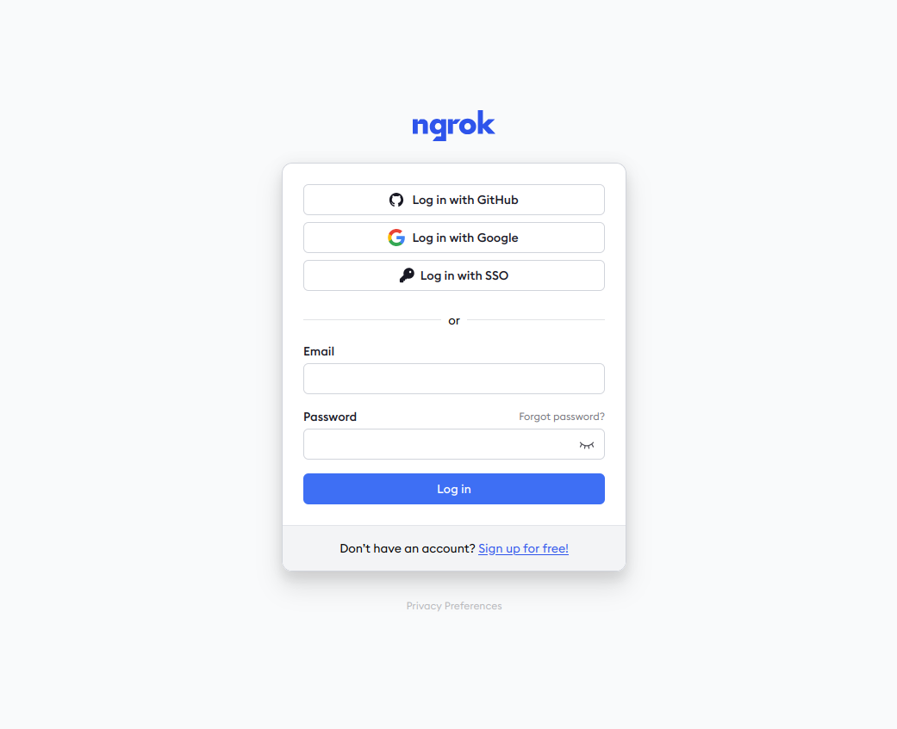
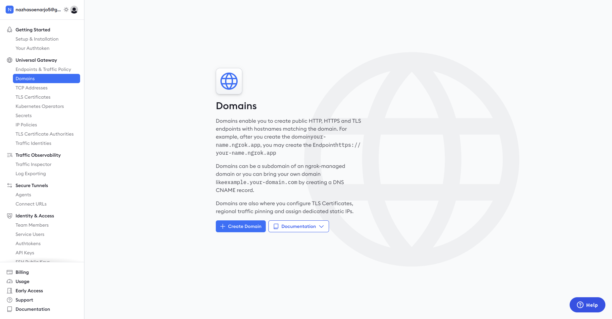
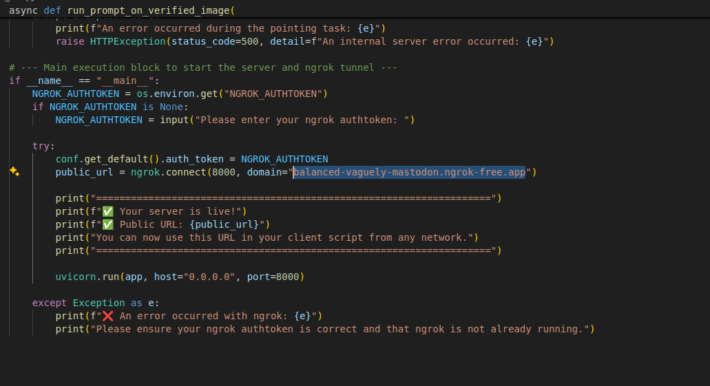
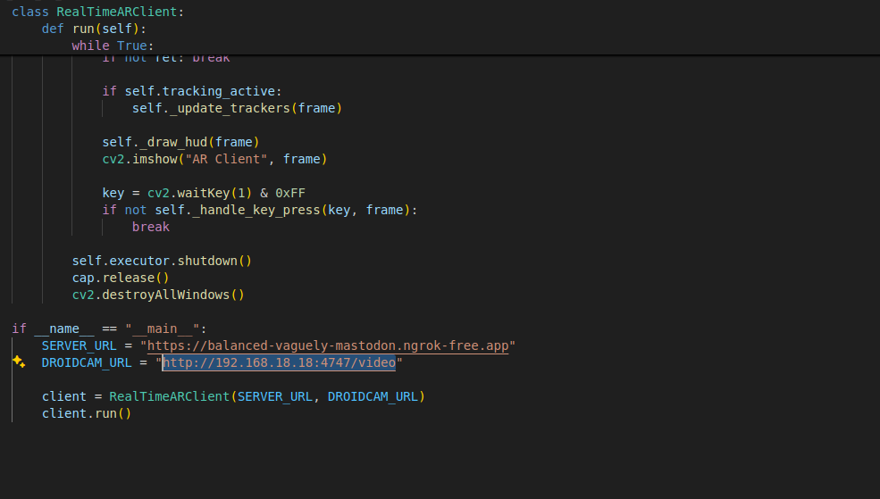

**RoboBrain Client-Server System Manual**

1. Git clone the repository to your device with the following command : 
   "git clone https://github.com/Nazha13/Robo-RAG-Setup.git"
2. Install the requirements.txt using “pip install \-r requirements.txt” (Recommended Environment \-\> Python 3.10)  
3. Main Component for development : New\_API.py, New\_Test\_AR\_DOT.py, [Inference.py](http://Inference.py)  
4. RAG masih belum sempurna, bisa dikembangkan lagi cara penambahan RAG.  
   

**Setup Server**

1. Buatlah akun ngrok dan sign in pada websitenya.  
     
2. Di samping kiri, click domain lalu create domain  
     
3. Copy domain yang terbentuk dan paste pada bagian ini pada program server (New\_API)  
     
4. Run program API, dan jika ditanyakan di terminal, inputkan Authtoken yang terdapat pada akun ngrok.

**Client**

1. Install Aplikasi Droidcam pada HP jika tidak ada webcam.  
2. Buka aplikasi droidcam di HP untuk memastikan sudah aktif.  
3. Pastikan wifinya sama, lalu paste IP yang ada dengan format yang sama seperti yang di program client.  
     
4. Jangan lupa menyesuaikan link dengan link server yang sedang aktif.
